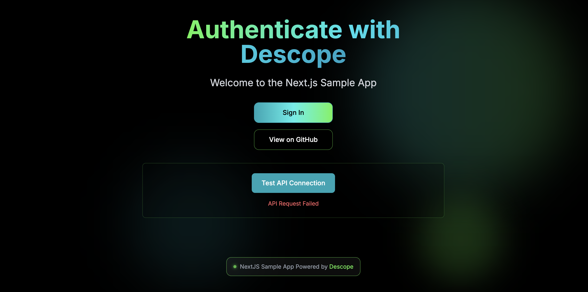
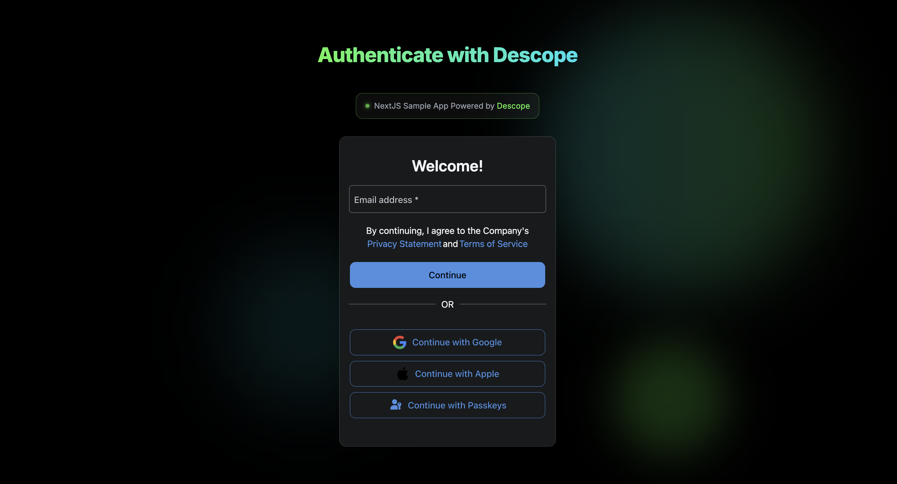

# Next.js + Descope Sample App

[](https://vercel.com/new/clone?repository-url=https%3A%2F%2Fgithub.com%2Fdescope-sample-apps%2Fnext-js-sample-app&env=NEXT_PUBLIC_DESCOPE_PROJECT_ID)

## Getting Started

1. Copy the `.env.local.example` to `.env.local` with the following variables:

```env
# Your Project ID
NEXT_PUBLIC_DESCOPE_PROJECT_ID=<project-id>
# Flow Id to run, e.g. sign-up-or-in
NEXT_PUBLIC_DESCOPE_FLOW_ID=<flow-id>
# Optional - Descope Base Url, either https://api.descope.com, https://api.sandbox.descope.com or http://localhost:8000
NEXT_PUBLIC_DESCOPE_BASE_URL=<base-url>
```

Run the development server:

```bash
npm run dev
# or
yarn dev
```

Open [http://localhost:3000](http://localhost:3000) with your browser to see the result.

## App Content

This app contains 2 components:

### Home Page

a. When a user is not signed-in:

- "Sign in" button (navigate to "Sign-in page")
- "API Request Failed" returned if you Test API Connection


b. When a user is signed in:

- Welcome message is displayed with the signed-in user name
- The "Test API Connection" button when clicked, should display API Request Successful
- "Logout" button


### Sign In Page

- Shows Sign In flow (Descope component)


## 🧪 Testing

1. Set up Descope environment variables in `.env.local` file

```
NEXT_PUBLIC_DESCOPE_PROJECT_ID="YOUR_DESCOPE_PROJECT_ID"
DESCOPE_MANAGEMENT_KEY="YOUR MANAGEMENT KEY" // Required
```

_You can get your project-id [here](https://app.descope.com/settings/project)_.
_You can get this flow-id from the Flows page [here](https://app.descope.com/flows)_.

2. Open the Cypress App
   Make sure you have the application running at `https://localhost:3000`. Then, in the root directory of the descope-explorer project, run the following to open the Cypress app:

```
npx cypress open
```

You'll need to select "E2E Testing" and your preferred browser for testing. For more info, check out the [Cypress Docs](https://docs.cypress.io/guides/getting-started/opening-the-app).

3. Run E2E Tests
   Now, simply click the "spec" you'd like to run and the test will start automatically.
